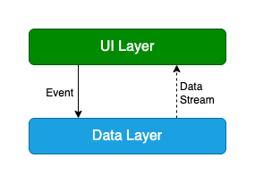

# Weatherman

## How to Setup this Projects

1. Clone this repository

2. Add secrets to your `local.properties`
   
   ```
   OPEN_WEATHER_API_KEY="YOUR_SECRET_KEY"  
   OPEN_WEATHER_BASE_URL="https://api.openweathermap.org/"
   ```

## Prerequisites

- Android Studio Electric Eel | 2022.1.1 Patch 1
- Min SDK 26
- Target SDK 33
- AGP 7.4.1
- Java 11
- Kotlin 1.8.0

## Libraries

- [Kotlin](https://kotlinlang.org/) based, [Coroutines](https://github.com/Kotlin/kotlinx.coroutines) + [Flow](https://kotlin.github.io/kotlinx.coroutines/kotlinx-coroutines-core/kotlinx.coroutines.flow/) for asynchronous.

- Jetpack
  - Lifecycle: Observe Android lifecycles and handle UI states upon the lifecycle changes.
  - ViewModel: Manages UI-related data holder and lifecycle aware. Allows data to survive configuration changes such as screen rotations.
  - DataBinding: Binds UI components in your app using a declarative format rather than programmatically.
  - Room: Constructs Database by providing an abstraction layer over SQLite to allow fluent database access.
  - [Hilt](https://dagger.dev/hilt/): for dependency injection.
- [Retrofit2 & OkHttp3](https://github.com/square/retrofit): Construct the REST APIs
- Gson:  JSON library for Kotlin and Java.
- [ksp](https://github.com/google/ksp): Kotlin Symbol Processing API.
- Material3 and Material: Basic building blocks for building UI
- Kotlinx Datetime: Provide date time object
- Secrets plugins: to store secret information like BASE_URL and API_KEY

## Modularization


**Weatherman** adopted modularization strategies below:

- **Reuseability**: Reusable code modules allow for appropriate code sharing opportunities while also limiting code accessibility in other modules.

- **Strict visibility control**: Modules limit the exposure of dedicated components and access to other layers, preventing them from being used outside of the module.

- **Decentralize focusing**: They can focus on their own modules by assign their dedicated modules

- **Parallel Execution**: Each module can be execute in parallel and it reduces the build time

The Rickypedia app contains following types of modules:

- The `app` module - contains app level and scaffolding classes that bind the rest of the codebase such as `MainActivity`, `WMApplication`, and app-level controlled navigation.

- `feature:` modules - feature specific modules which are scoped to handle a single responsibility in the app. These module can be reused by any app, including test or other flavoured apps, when needed while still keeping it separated and isolated. when a class is needed only by one `feature` module then it should remain within that module. If not, then should be extracted into an appropriate `core` module. A feature `module` should have no dependency on other features modules.

- `core:` modules - common library modules containing specific dependency that need to be shared between other modules in the app. These modules can depend on other core modules and shouldn't depend on feature nor app modules.

- Miscellaneous modules - such as `test` modules

For further information, check out the [Guide to Android app modularization](https://developer.android.com/topic/modularization)

## Modules

Using the above modularization strategy, the Weatherman app has the following modules

| Name                 | Responsibility                                                                                                        |
| -------------------- | --------------------------------------------------------------------------------------------------------------------- |
| `:app`               | Brings everything together for the app to function correctly including UI scaffolding and navigation                  |
| `:feature:home`      | Display weather forecast and city selection                                                                           |
| `:core:model`        | Model classes used throughout the app                                                                                 |
| `:core:designsystem` | Design Foundation (Typography, ColorScheme, Spacings, Theme, Shapes), common composable components, common resources. |
| `:core:data`         | Fetching app data from multiple sources, shared by different features                                                 |
| `:core:network`      | Making network request and handling response from a remote data source                                                |
| `:core:database`     | Local database storage                                                                                                |
| `:core:datastore`    | User preferences storage                                                                                              |

## Architecture



**Weatherman** is a based on the MVVM architecture and the Repository pattern which follows the [Guide to app architecture](https://developer.android.com/topic/architecture)

#### Overview

The app architecture has two layers: a data layer and a UI layer.

The architecture follows a reactive programming model with unidirectional data flow.

- Higher layers react to changes in lower layers

- Events flow down

- Data flows up

With this loosely coupled architecture we can uncrease the reusability of components and scalability of our apps.

#### UI Layer


The UI Layer includes:

- UI Elements built using Jetpack Compose.

- Android ViewModel that holds UI state and restore data when configuration changes.

ViewModels receive data streams from repositories and transform them into UI state. The UI elements should reflect this state and allow the user to interact with the app. These interactions are passed as action to the ViewModel, which processes them.

### Data Layer


The Data layer includes

- DataStore to store user preferences like city preferences

- Database (Room) to store favorite cities

- Network (REST Api) to receive weather data and search cities based on user queries 

- Repository as single source of truth of this application

Each repository has its own models. For example, the `CityRepository` has a City model and the `WeatherForecasRepository` has a `Weather` model. 

Repositories are the public API for other layers, they provide the only way to access the app data. The repositories typically offer one or more methods for reading and writing data.
